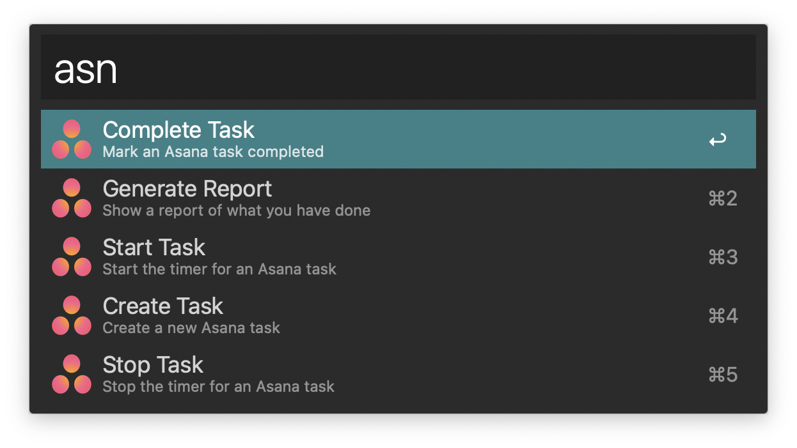

Asana Tracker for [Alfred](http://www.alfredapp.com)
=============================

Create new tasks, mark tasks complete, and track the hours spent on each task.

## Installation

1. Download the [latest release](https://github.com/pinuz95/alfred-asana-tracker/releases) of the workflow.

2. Double click to add it to Alfred.

3. Run any command and follow the instructions for the setup.

### Reports

If you want to generate reports of what you have done, you need to install [QLMarkdown](https://github.com/toland/qlmarkdown), a QuickLook plugin to preview Markdown files. To install it, open a terminal and run the following command

`brew cask install qlmarkdown`

## Usage

### Commands
| Command           | Action                                                       |
| :---------------- | :----------------------------------------------------------- |
| asn create        | Create a new task                                            |
| asn complete      | Mark a task complete                                         |
| asn start         | Start the timer of a task                                    |
| asn stop          | Stop the timer of a task                                     |
| asn report        | Show a report of what you have done. You can specify a time frame |
| asn set token     | Set your [Personal Access Token](https://app.asana.com/0/developer-console) |
| asn set workspace | Set your default workspace                                   |
| asn set project   | Set your default project                                     |

New tasks are created on your default project.

When you `start` a task, you'll be asked to select the field where you want to track the spent hours. Please note that when you `stop` or `complete` the task, this field will be overwritten by Alfred.

### Examples

* `asn create feed the hamster`
* `asn complete learn ballade no. 1 in g minor`
* `asn start prove p=np`
* `asn stop find the x`
* `asn set project conquer the world`
* `asn report week`
* `asn report 8 hours`
* `asn report 2 days`

